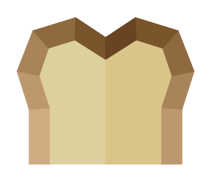

<p align="center">
  
</p>
<h1 align="center" style="margin: 0px">Material Bread</h1>

Highly customizable React Native Material Design Components.

### [Docs](http://material-bread.org)
### [Storybook](https://codypearce.github.io/material-bread/)


## Installation

Material Bread is available on [npm](https://www.npmjs.com/package/material-bread).

```sh
npm install material-bread
```
or
```sh
yarn add material-bread
```

## Getting Started

[React Native](http://material-bread.org/getting-started/react-native)

[Web](http://material-bread.org/getting-started/web)

[Electron](http://material-bread.org/getting-started/electron)

## Example Repos

[React Native](https://github.com/codypearce/material-bread-rn-example)

[Expo](https://github.com/codypearce/material-bread-expo-example)

[React](https://github.com/codypearce/material-bread-react-example)

[Electron](https://github.com/codypearce/material-bread-electron-example)

## Usage 

```jsx
import React from 'react';
import Button from 'material-bread';

function App() {
  return (
    <Button type="contained" >
      Click Me
    </Button>
  );
}
```

## Contributing

Any contributions are welcome, you can read more about [contributing in the docs](http://material-bread.org/contributing/library)
